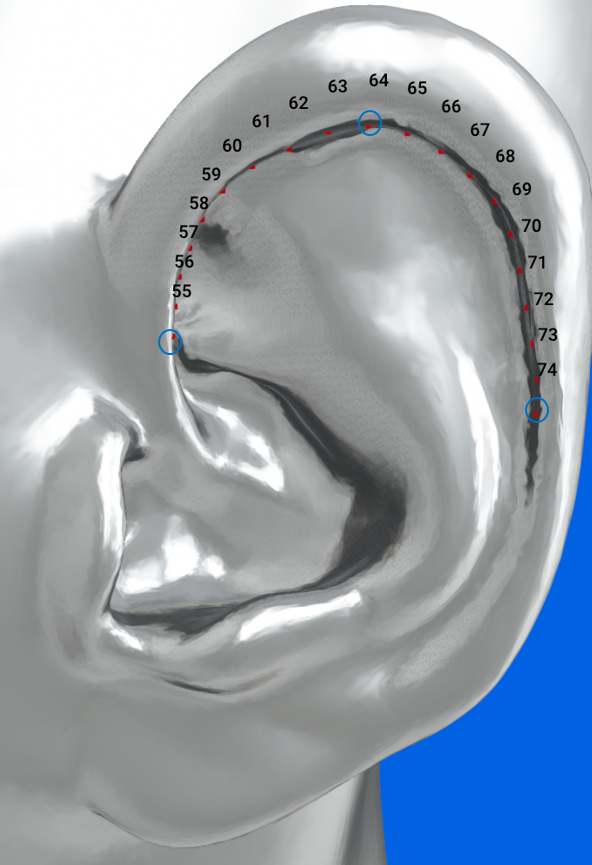

# Pinna Landmark Extraction with PointNet++

This repository contains both the original PointNet++ baseline and the proposal-aligned
v2 coarse-to-fine pipeline for the Tech Arena 2026 pinna landmark extraction task.
The v2 pipeline audits the data, uses nested subject-level cross-fitting for an ear
centre locator, calibrates leakage-safe crops, and predicts 85 ordered landmarks per ear.

The current code supports two input modes:

- `full`: sample points from the full head mesh and use one PointNet++ encoder.
- `ear_crop`: crop one ear submesh, sample that cropped surface, and use one shared PointNet++ model to predict 85 landmarks for that ear.

The model input is sampled point features:

```text
[x, y, z, normal_x, normal_y, normal_z]
```

The model output is:

```text
left_landmarks:  (85, 3)
right_landmarks: (85, 3)
```


## Installation

The recommended setup for the HPC environment is a conda environment with PyTorch installed from the official CUDA wheel index.

```bash
conda create -n anthropometric_env python=3.10 -y
conda activate anthropometric_env
```

For the H200 training node, install a PyTorch build compatible with the cluster's
CUDA driver. For a CUDA 12.8-compatible environment, for example:

```bash
pip install torch torchvision torchaudio --index-url https://download.pytorch.org/whl/cu128
```

If your cluster driver requires a different CUDA build, choose the matching command from the official PyTorch install page:

https://pytorch.org/get-started/locally/

Install the remaining packages:

```bash
pip install -r requirements.txt
```

The requirements file also lists `torch` for simple local setup. If your HPC has strict CUDA package rules, install the CUDA PyTorch wheel first as shown above, then install the remaining packages.

Check that PyTorch can see the GPU:

```bash
python - <<'PY'
import torch
print("torch:", torch.__version__)
print("cuda available:", torch.cuda.is_available())
print("cuda version:", torch.version.cuda)
if torch.cuda.is_available():
    print("gpu:", torch.cuda.get_device_name(0))
PY
```

## Dataset Layout

The Iridis data root is:

```text
/iridisfs/home/kjl1a21/Automatic-Extraction-of-Anatomical-Landmarks-of-Pinna-Shape/data/
```

It uses this layout:

```text
/iridisfs/home/kjl1a21/Automatic-Extraction-of-Anatomical-Landmarks-of-Pinna-Shape/data/
  mesh/
    <subject_id>.ply
  landmarks/
    <subject_id>_left_ear_landmarks.csv
    <subject_id>_right_ear_landmarks.csv
```

Example:

```text
/iridisfs/home/kjl1a21/Automatic-Extraction-of-Anatomical-Landmarks-of-Pinna-Shape/data/mesh/P0001.ply
/iridisfs/home/kjl1a21/Automatic-Extraction-of-Anatomical-Landmarks-of-Pinna-Shape/data/landmarks/P0001_left_ear_landmarks.csv
/iridisfs/home/kjl1a21/Automatic-Extraction-of-Anatomical-Landmarks-of-Pinna-Shape/data/landmarks/P0001_right_ear_landmarks.csv
```

No challenge subject is excluded by default. The corrected `P0027` annotations and
KEMAR are included. The strict audit must pass before folds or training are created.

## Proposal-Aligned Pipeline

The full workflow is exposed through one CLI:

```bash
python train_pipeline.py --help
python train_pipeline.py audit \
  --mesh-dir /iridisfs/home/kjl1a21/Automatic-Extraction-of-Anatomical-Landmarks-of-Pinna-Shape/data/mesh \
  --landmarks-dir /iridisfs/home/kjl1a21/Automatic-Extraction-of-Anatomical-Landmarks-of-Pinna-Shape/data/landmarks \
  --output-root /iridisfs/home/kjl1a21/Automatic-Extraction-of-Anatomical-Landmarks-of-Pinna-Shape/dataset_analysis_outputs
python train_pipeline.py make-folds \
  --audit-json /iridisfs/home/kjl1a21/Automatic-Extraction-of-Anatomical-Landmarks-of-Pinna-Shape/dataset_analysis_outputs/audit_TIMESTAMP/dataset_audit.json \
  --output artifacts/folds.json
```

Train all nested and outer locator folds, then calibrate the final crop from the
five outer out-of-fold prediction sets:

```bash
python train_pipeline.py fit-locator \
  --mesh-dir /iridisfs/home/kjl1a21/Automatic-Extraction-of-Anatomical-Landmarks-of-Pinna-Shape/data/mesh --landmarks-dir /iridisfs/home/kjl1a21/Automatic-Extraction-of-Anatomical-Landmarks-of-Pinna-Shape/data/landmarks \
  --folds-json artifacts/folds.json --outer-fold all \
  --output-dir runs/locator_cv --amp
python train_pipeline.py calibrate \
  --mesh-dir /iridisfs/home/kjl1a21/Automatic-Extraction-of-Anatomical-Landmarks-of-Pinna-Shape/data/mesh --landmarks-dir /iridisfs/home/kjl1a21/Automatic-Extraction-of-Anatomical-Landmarks-of-Pinna-Shape/data/landmarks \
  --locator-run-root runs/locator_cv --outer-fold final \
  --output artifacts/final_crop_calibration.json
python train_pipeline.py validate-calibration \
  --mesh-dir /iridisfs/home/kjl1a21/Automatic-Extraction-of-Anatomical-Landmarks-of-Pinna-Shape/data/mesh --landmarks-dir /iridisfs/home/kjl1a21/Automatic-Extraction-of-Anatomical-Landmarks-of-Pinna-Shape/data/landmarks \
  --calibration-json artifacts/final_crop_calibration.json \
  --predictions-json artifacts/final_crop_calibration_predictions.json \
  --outer-fold final --output artifacts/final_crop_validation.json
python train_pipeline.py validate-calibration \
  --mesh-dir /iridisfs/home/kjl1a21/Automatic-Extraction-of-Anatomical-Landmarks-of-Pinna-Shape/data/mesh --landmarks-dir /iridisfs/home/kjl1a21/Automatic-Extraction-of-Anatomical-Landmarks-of-Pinna-Shape/data/landmarks \
  --calibration-json 'artifacts/fold{fold}_crop_calibration.json' \
  --predictions-json 'artifacts/fold{fold}_crop_calibration_predictions.json' \
  --folds-json artifacts/folds.json --outer-fold all \
  --output artifacts/outer_fold_crop_validation.json
```

`validate-calibration` is CPU-only and exits with status 2 unless primary
complete-ear coverage is at least 99%, backup coverage is exactly 100%, and the
backup bounds are a component-wise superset of the primary bounds. The `all`
form pools held-out counts across all five folds; keep `{fold}` single-quoted so
the shell passes the path template unchanged. For one fold, pass its literal
paths with `--folds-json artifacts/folds.json --outer-fold N`.

For an outer-fold landmark experiment, first create that fold's calibration with
`--outer-fold 0`, then use its generated `_predictions.json` file:

```bash
python train_pipeline.py fit-landmarks \
  --mesh-dir /iridisfs/home/kjl1a21/Automatic-Extraction-of-Anatomical-Landmarks-of-Pinna-Shape/data/mesh --landmarks-dir /iridisfs/home/kjl1a21/Automatic-Extraction-of-Anatomical-Landmarks-of-Pinna-Shape/data/landmarks \
  --folds-json artifacts/folds.json --outer-fold 0 \
  --calibration-json artifacts/fold0_crop_calibration.json \
  --predictions-json artifacts/fold0_crop_calibration_predictions.json \
  --output-dir runs/fold0_pointnet2_four_heads --four-heads --amp
```

After the registered five-fold/three-seed comparisons select a configuration, use
the cross-validation best epochs to retrain and package one deterministic model:

```bash
python train_pipeline.py fit-final \
  --mesh-dir /iridisfs/home/kjl1a21/Automatic-Extraction-of-Anatomical-Landmarks-of-Pinna-Shape/data/mesh --landmarks-dir /iridisfs/home/kjl1a21/Automatic-Extraction-of-Anatomical-Landmarks-of-Pinna-Shape/data/landmarks \
  --locator-run-root runs/locator_cv \
  --calibration-json artifacts/final_crop_calibration.json \
  --locator-epochs 120 --landmark-epochs 150 \
  --output-dir checkpoints
python train_pipeline.py package \
  --checkpoint checkpoints/final_pipeline.pt \
  --output artifacts/pinna_submission.zip
```

The epoch numbers above are examples only; supply the selected values from the
completed cross-validation manifests rather than treating them as defaults.

The exact experiment order and promotion rule are recorded in
`configs/experiment_matrix.json`; the method and leakage controls are documented
in `TECHNICAL_METHOD.md`, with the reviewed literature and project sources in
`RESEARCH_BASIS.md`.

## Quick Start

Train the default full-head baseline:

```bash
python train_pointnet2.py
```

Train the ear-crop baseline:

```bash
python train_pointnet2.py \
  --mesh-dir /iridisfs/home/kjl1a21/Automatic-Extraction-of-Anatomical-Landmarks-of-Pinna-Shape/data/mesh \
  --landmarks-dir /iridisfs/home/kjl1a21/Automatic-Extraction-of-Anatomical-Landmarks-of-Pinna-Shape/data/landmarks \
  --input-mode ear_crop \
  --ear-points 16384 \
  --crop-margin 0.40
```

Run a small smoke test:

```bash
python train_pointnet2.py --epochs 1 --batch-size 1 --num-points 128
python train_pointnet2.py --epochs 1 --batch-size 1 --input-mode ear_crop --ear-points 128
```

Submit a pipeline stage to H200 (the complete locator example is in the HPC section):

```bash
sbatch submit_job_train_pointnet2.slurm audit \
  --mesh-dir /iridisfs/home/kjl1a21/Automatic-Extraction-of-Anatomical-Landmarks-of-Pinna-Shape/data/mesh \
  --landmarks-dir /iridisfs/home/kjl1a21/Automatic-Extraction-of-Anatomical-Landmarks-of-Pinna-Shape/data/landmarks \
  --output-root /iridisfs/home/kjl1a21/Automatic-Extraction-of-Anatomical-Landmarks-of-Pinna-Shape/dataset_analysis_outputs
```

The scheduler script forwards the stage and arguments unchanged to `train_pipeline.py`.

## Outputs

Training writes files under `--checkpoint-dir`.

Common files:

- `best_model.pt`: checkpoint with the best validation mean distance.
- `last_model.pt`: checkpoint from the latest epoch.
- `run_config.json`: full run configuration.
- `crop_config.json`: fitted crop boxes for `ear_crop` mode.
- `crop_coverage.json`: landmark coverage for the crop boxes.
- `crop_sampling_stats.json`: point sampling counts for crop mode.

In `ear_crop` mode, crop visual files are saved under:

```text
checkpoints/crops/{train,val}/
```

Crop file meanings:

- `{subject}_{left/right}_mesh.ply`: exact clipped crop mesh.
- `{subject}_{left/right}_points.ply`: sampled crop point cloud before optional right-ear mirroring.

Use `_points.ply` when checking what the model receives.

## Model Modes

### Full Mesh

`--input-mode full` samples `--num-points` points from the full mesh. The default is `16384`.

Flow:

```text
full mesh -> 16384 points -> PointNet++ encoder -> prediction layers -> 170 x 3 landmarks
```

### Ear Crop

`--input-mode ear_crop` fits left and right crop boxes from the training landmarks only. It then clips the mesh to one ear box, samples `--ear-points` points from that cropped surface, and predicts 85 landmarks for that ear. Each subject contributes one left-ear sample and one right-ear sample during training.

Flow:

```text
full mesh -> exact left/right ear crop -> 16384 crop-surface points -> PointNet++ -> 85 x 3 landmarks
```

Legacy ear-crop checkpoint behaviour remains unchanged. In the v2 pipeline,
right-ear points, normals, and targets are mirrored consistently, and predictions
are reflected back before being returned.

## Training Arguments

Run this command for the live argument list:

```bash
python train_pointnet2.py --help
```

### Data and Split Arguments

| Argument | Default | Meaning |
| :--- | :--- | :--- |
| `--mesh-dir` | `/iridisfs/home/kjl1a21/Automatic-Extraction-of-Anatomical-Landmarks-of-Pinna-Shape/data/mesh` | Folder containing subject `.ply` meshes. |
| `--landmarks-dir` | `/iridisfs/home/kjl1a21/Automatic-Extraction-of-Anatomical-Landmarks-of-Pinna-Shape/data/landmarks` | Folder containing left and right landmark CSV files. |
| `--checkpoint-dir` | `checkpoints` | Folder where checkpoints, configs, and crop files are saved. |
| `--train-split-file` | `None` | Optional text file with one training subject ID per line. |
| `--val-split-file` | `None` | Optional text file with one validation subject ID per line. |
| `--val-ratio` | `0.2` | Validation fraction when split files are not provided. |
| `--seed` | `42` | Random seed for splitting, sampling, and training setup. |
| `--workers` | `10` | Number of PyTorch data loader workers. |

If split files are used, provide both `--train-split-file` and `--val-split-file`.

### Input and Sampling Arguments

| Argument | Default | Meaning |
| :--- | :--- | :--- |
| `--input-mode` | `full` | Choose `full` or `ear_crop`. |
| `--num-points` | `16384` | Number of sampled full-mesh points for `full` mode. |
| `--ear-points` | `16384` | Number of sampled points per ear for `ear_crop` mode. |
| `--num-landmarks` | mode-specific | Number of output landmarks. Resolves to `170` for `full` and `85` for `ear_crop`. |
| `--no-normals` | `False` | Disable normal channels in the PointNet++ input. |

### Crop Arguments

| Argument | Default | Meaning |
| :--- | :--- | :--- |
| `--crop-margin` | `0.4` | Expands fitted crop boxes around the training landmarks. |
| `--crop-oversample-factor` | `8` | Retained for checkpoint compatibility; crop mode now samples directly from the clipped submesh. |
| `--crop-max-resample-attempts` | `5` | Retained for checkpoint compatibility; crop mode now samples directly from the clipped submesh. |
| `--crop-min-inside-ratio` | `0.0` | Retained for checkpoint compatibility; crop mode now samples directly from the clipped submesh. |
| `--save-crop-ply` | `True` | Save crop mesh and sampled crop point PLY files. |
| `--no-save-crop-ply` | `False` | Disable crop PLY export. |
| `--mirror-right-ear` | `False` | Mirror right-ear input points into left-ear orientation. |
| `--no-mirror-right-ear` | `False` | Keep right-ear input points in original orientation. |

### Model Arguments

| Argument | Default | Meaning |
| :--- | :--- | :--- |
| `--variant` | `ssg` | PointNet++ type. Choose `ssg` or `msg`. |
| `--head-channels` | `512,256` | Hidden layer sizes for the final prediction layers. |
| `--dropout` | `0` | Dropout probability in the final prediction layers. |
| `--ssg-npoints` | `512,128` | Number of center points kept in each SSG layer. |
| `--ssg-radii` | `0.2,0.4` | Search radii for SSG layers. |
| `--ssg-nsamples` | `32,64` | Neighbor counts for SSG layers. |
| `--ssg-mlps` | `64,64,128;128,128,256;256,512,1024` | SSG layer sizes. Separate layers with `;`. |
| `--msg-npoints` | `512,128` | Number of center points kept in each MSG layer. |
| `--msg-radii` | `0.1,0.2,0.4;0.2,0.4,0.8` | MSG radii. Separate layers with `;` and scales with `,`. |
| `--msg-nsamples` | `16,32,128;32,64,128` | MSG neighbor counts. Separate layers with `;`. |
| `--msg-mlps` | `32,32,64|64,64,128|64,96,128;64,64,128|128,128,256|128,128,256` | MSG layer sizes. Separate scales with `|` and layers with `;`. |
| `--msg-global-mlp` | `256,512,1024` | Final MSG feature sizes. |

### Optimizer, Loss, and Runtime Arguments

| Argument | Default | Meaning |
| :--- | :--- | :--- |
| `--epochs` | `200` | Number of training epochs. |
| `--batch-size` | `4` | Batch size. |
| `--learning-rate` | `1e-3` | Optimizer learning rate. |
| `--weight-decay` | `1e-4` | Weight decay. |
| `--optimizer` | `adamw` | Choose `adam`, `adamw`, or `sgd`. |
| `--loss` | `smooth_l1` | Choose `smooth_l1`, `mse`, `l1`, or `mean_distance`. |
| `--smooth-l1-beta` | `1.0` | Beta value for Smooth L1 loss. |
| `--momentum` | `0.9` | Momentum for SGD. |
| `--scheduler` | `cosine` | Choose `none`, `cosine`, or `step`. |
| `--step-size` | `50` | Step size for the step scheduler. |
| `--step-gamma` | `0.5` | Decay factor for the step scheduler. |
| `--grad-clip-norm` | `0.0` | Gradient clipping value. `0.0` disables clipping. |
| `--amp` | `False` | Enable mixed precision training on CUDA. |
| `--device` | `auto` | Choose `auto`, `cpu`, or a CUDA device such as `cuda:0`. |

## Evaluation

The official score is the mean Euclidean distance between predicted and ground-truth landmarks.

For one ear of subject `j`, with `N` landmarks:

$$
d\left(L^{j, ear}_{out}, L^{j, ear}_{gt}\right)
=\frac{1}{N} \sum_{i=1}^{N}
\left\lVert l^{j, ear}_{out, i} - l^{j, ear}_{gt, i} \right\rVert
$$

The final score averages this distance across all hidden test subjects and both ears:

$$
MD =\frac{1}{2M} \sum_{j=1}^{M} \sum_{ear}
d\left(L^{j, ear}_{out}, L^{j, ear}_{gt}\right),
\quad ear \in \{left, right\}
$$

This metric is implemented in [`src/metrics.py`](src/metrics.py).

During training:

- `train_loss` is the selected training loss.
- `val_loss` is the selected validation loss.
- `train_md` is the mean landmark distance on the training split.
- `val_md` is the mean landmark distance on the validation split.

If the mesh coordinates are in millimetres, `train_md` and `val_md` are also in millimetres.

Use this loss if you want the training objective to match the official metric:

```bash
python train_pointnet2.py --loss mean_distance
```

The default loss is:

```text
smooth_l1
```

## Inference and Submission

The challenge entry point is:

```text
src.estimator.LandmarkExtractor
```

By default, it loads the proposal-aligned bundle:

```text
checkpoints/final_pipeline.pt
```

If the checkpoint is missing, `LandmarkExtractor` raises a clear error. Before submitting, place the trained checkpoint at this path or change the default path in a controlled way.

The extractor returns:

```python
left, right = extractor.extract(mesh)
```

where:

```text
left.shape  == (85, 3)
right.shape == (85, 3)
```

Challenge submissions must include:

1. Source code that extracts left and right pinna landmarks.
2. A brief description of the method.
3. Training code and references to any extra datasets used.

## Visualization and Debugging

The qualitative viewer accepts proposal fold `best_landmarks.pt` checkpoints only.
It reconstructs the exact held-out OOF-centred validation crop, compares coarse,
final, and surface-projected landmarks with ground truth, and exports spatial
gradient/occlusion importance. Existing checkpoints require the original run seed:

```bash
python visualize_point_importance.py single \
  --checkpoint-path runs/refinement_screen/CANDIDATE/fold0_seed42/best_landmarks.pt \
  --predictions-json artifacts/calibration_v2/fold0_crop_calibration_predictions.json \
  --calibration-json artifacts/calibration_v2/fold0_crop_calibration.json \
  --folds-json artifacts/folds.json \
  --mesh-dir /iridisfs/home/kjl1a21/Automatic-Extraction-of-Anatomical-Landmarks-of-Pinna-Shape/data/mesh \
  --landmarks-dir /iridisfs/home/kjl1a21/Automatic-Extraction-of-Anatomical-Landmarks-of-Pinna-Shape/data/landmarks \
  --run-seed 42 --subject-id PXXXX --ear both \
  --output-dir qualitative_outputs/refinement_candidate
```

Replace `PXXXX` with a subject listed under outer fold 0's `validation` array. The
viewer deliberately rejects training subjects and mismatched artifacts. To render
the held-out best, median, and worst ears, replace `single`, `--subject-id`, and
`--ear` with `gallery`.

Each rendered ear contains PNG and GLB overlays, exact colored PLY inputs, a
per-landmark CSV, raw NPZ arrays, and a JSON manifest. Importance is based on the
raw fold prediction; exact surface projection is reported separately and is not
part of the differentiable importance objective.

Quantitatively compare raw and exact surface-projected predictions on every
held-out ear for one fold checkpoint with:

```bash
python train_pipeline.py evaluate-projection \
  --checkpoint-path runs/pointnext_s/fold0_seed42/best_landmarks.pt \
  --predictions-json artifacts/calibration_v2/fold0_crop_calibration_predictions.json \
  --calibration-json artifacts/calibration_v2/fold0_crop_calibration.json \
  --folds-json artifacts/folds.json \
  --mesh-dir /iridisfs/home/kjl1a21/Automatic-Extraction-of-Anatomical-Landmarks-of-Pinna-Shape/data/mesh \
  --landmarks-dir /iridisfs/home/kjl1a21/Automatic-Extraction-of-Anatomical-Landmarks-of-Pinna-Shape/data/landmarks \
  --run-seed 42 \
  --output runs/projection/pointnext_s/fold0_seed42.json \
  --device auto
```

The output records pooled and per-landmark raw/projected MD, every held-out
ear's scores, projection displacement, and projection-only runtime. Apply the
same five-fold/three-seed promotion rule before enabling final-model projection.

For ear-crop runs, inspect the crop PLY files under:

```text
checkpoints/crops/{train,val}/
```

Use `_points.ply` files to see the sampled crop points. Use `_mesh.ply` files only as context.

## HPC Training

The scheduler script uses the agreed `quad_h200` allocation and forwards a pipeline
stage plus all remaining arguments. Submit one outer locator fold per job, for example:

```bash
sbatch submit_job_train_pointnet2.slurm fit-locator \
  --mesh-dir /iridisfs/home/kjl1a21/Automatic-Extraction-of-Anatomical-Landmarks-of-Pinna-Shape/data/mesh \
  --landmarks-dir /iridisfs/home/kjl1a21/Automatic-Extraction-of-Anatomical-Landmarks-of-Pinna-Shape/data/landmarks \
  --folds-json artifacts/folds.json \
  --outer-fold 0 \
  --output-dir runs/locator_cv
```

Each pipeline run stores:

- checkpoint files
- logs
- the exact training command
- the sbatch configuration
- `run_config.json`

This supports restartable fold/seed jobs and auditable comparisons across the registered
experiment sequence.

## Project Structure

```text
.
|-- train_pointnet2.py               # Training entry point
|-- train_pipeline.py                # Proposal-aligned staged pipeline
|-- visualize_point_importance.py    # Held-out fold qualitative viewer
|-- submit_job_train_pointnet2.slurm # HPC training script
|-- src/
|   |-- dataset.py                   # Mesh and landmark file loading
|   |-- torch_dataset.py             # PyTorch datasets
|   |-- preprocessing.py             # Sampling and normalization
|   |-- ear_crop.py                  # Ear crop fitting and sampling
|   |-- pointnet2_model.py           # PointNet++ models
|   |-- pointnet2_utils.py           # PointNet++ utility code
|   |-- estimator.py                 # Challenge inference entry point
|   |-- calibration.py               # OOF crop calibration
|   |-- proposal_models.py           # Locator, contour heads, refinement
|   |-- pointnext_model.py            # Portable PointNeXt-S-style encoder
|   `-- metrics.py                   # Official mean distance metric
|-- tests/
|   `-- test_pointnet2_baseline.py
|-- img/
|-- requirements.txt
`-- THIRD_PARTY_NOTICES.md
```

## Competition Data and Rules

The challenge provides 3D meshes of the head and torso for 200 subjects, with 85 landmarks for the left pinna and 85 landmarks for the right pinna.

To obtain access to the dataset, a data sharing permission form must be signed by all team members. The form is available from the submission section of the team page. After submission, the dataset access details are sent by email.

All submitted models are evaluated on a hidden test set. Only the latest submission before the challenge deadline is considered for each team and shown on the leaderboard.

## Mesh Alignment

The provided meshes are aligned as follows:

- The Y-axis runs from the left ear canal entrance to the right ear canal entrance.
- The X-axis runs from the back of the head to the front of the head, passing the nose tip.
- The Z-axis runs upward toward the top of the head.
- The head center is defined by the intersection of these axes.

This alignment keeps the annotations consistent across subjects.

## Background

Binaural audio rendering simulates sound sources in 3D space around a listener. It is used in virtual reality, augmented reality, and consumer audio.

To create the effect of sound coming from a specific direction, sound signals are filtered by head-related transfer functions, also called HRTFs. HRTFs depend on the shape of the head and pinna. Because each person has different anatomy, using another person's HRTFs can reduce sound quality and localization accuracy.

Accurate individual HRTFs usually require acoustic measurements. A more scalable option is to estimate useful anthropometric information from 3D scans. This challenge focuses on extracting pinna landmarks from those scans.

## Pinna Landmarks

The pinna, also called the auricle, is the outer ear. It captures sound waves and directs them into the ear canal.

The pinna contains several important parts:

- helix
- antihelix
- concha


The provided landmarks are grouped into four contours:

- outer helix
- outer concha
- inner helix
- superior antihelix

Each contour has fixed anchor landmarks. The remaining landmarks are placed between anchor points.

### Anchor Points

| Outer helix contour | Visualization |
| :--- | :--- |
| Index 0: upper connection of helix with head, at the center of the ridge.<br>Index 6: upper point of the largest extent of the outer helix, on the top of the ridge.<br>Index 22: lower point of the largest extent of the outer helix, on the top of the ridge.<br>Index 24: lower connection of helix with head, at the center of the ridge. |  |

| Concha outline | Visualization |
| :--- | :--- |
| Index 25: connection of concha with helix at 90 degrees view.<br>Index 33: junction of fossa and outer concha contour.<br>Index 42: antitragus at highest curvature.<br>Index 46: saddle point below tragus.<br>Index 50: tragus at highest curvature.<br>Index 54: saddle point above tragus. |  |

| Inner helix | Visualization |
| :--- | :--- |
| Index 55: inner helix ridge at height of concha start.<br>Index 64: point opposite the highest point of the outer helix.<br>Index 74: end point of the continuation of the contour line for another 10 points with the same neighbor distance. |  |

| Superior antihelix | Visualization |
| :--- | :--- |
| Index 75: junction of fossa and outer concha contour.<br>Index 84: connection of fossa with helix. |  |

A full set of landmarks for one ear has shape:

```text
85 x 3
```

## Optional Point Transformer V3 environment

The exact Point Transformer V3 research backbone uses compiled CUDA packages
and must be installed in a separate environment. It is not required for the
portable PointNeXt baseline or the current competition ZIP. The complete
training and evaluation workflow is documented in
[`PTV3_EXPERIMENT.md`](PTV3_EXPERIMENT.md).

The installation order matters. In particular, Torch `2.1.0` requires NumPy
1.x for this environment, and its legacy C++ extension loader requires the
`pkg_resources.packaging` compatibility export retained by setuptools
`69.5.1`. Setuptools 70 or newer causes FlashAttention metadata generation to
fail.

```bash
conda create -n anthropometric_ptv3_env python=3.10 -y
conda activate anthropometric_ptv3_env
conda install pytorch==2.1.0 torchvision==0.16.0 torchaudio==2.1.0 pytorch-cuda=11.8 -c pytorch -c nvidia -y
conda install cuda-nvcc=11.8 -c nvidia -y

python -m pip install --upgrade pip
python -m pip install --force-reinstall numpy==1.26.4 setuptools==69.5.1 wheel==0.43.0 packaging==24.0 psutil==5.9.8
python -m pip install ninja fsspec
python -m pip install -r requirements.txt
python -m pip install torch-scatter==2.1.2 -f https://data.pyg.org/whl/torch-2.1.0+cu118.html
python -m pip install addict==2.4.0 timm==0.9.16 spconv-cu118==2.3.8

export CUDA_HOME="$CONDA_PREFIX"
export PATH="$CUDA_HOME/bin:$PATH"
export MAX_JOBS=8
python -m pip install flash-attn==2.5.9.post1 --no-build-isolation
python -m pip install --no-build-isolation -r requirements-ptv3.txt
python -m pip check
```

Compile FlashAttention on an allocated compute node, not a login node. Before
training, run the required `ptv3-preflight` gate described in the detailed
guide. If FlashAttention reports that `packaging` cannot be imported from
`pkg_resources`, reinstall `setuptools==69.5.1`. If its isolated build reports
that Torch is missing, repeat the installation with `--no-build-isolation`.

PTv3 checkpoints explicitly record `amp_dtype: float16` and
`encoder_config.spconv_algorithm: native`. PTv3 uses FP16 autocast and gradient
scaling while losses and metrics are accumulated in FP32. The native sparse
convolution algorithm bypasses the spconv implicit-GEMM tuner failure reported
for mixed-precision evaluation in
[PTv3 issue #176](https://github.com/Pointcept/PointTransformerV3/issues/176)
and [spconv issue #563](https://github.com/traveller59/spconv/issues/563).
Do not force the complete network into training mode for validation. Other
backbones continue to prefer BF16 on H200.

## Third-Party Code

`src/pointnet2_utils.py` adapts PointNet++ utilities from:

https://github.com/yanx27/Pointnet_Pointnet2_pytorch

The upstream project is distributed under the MIT License. See [`THIRD_PARTY_NOTICES.md`](THIRD_PARTY_NOTICES.md).
